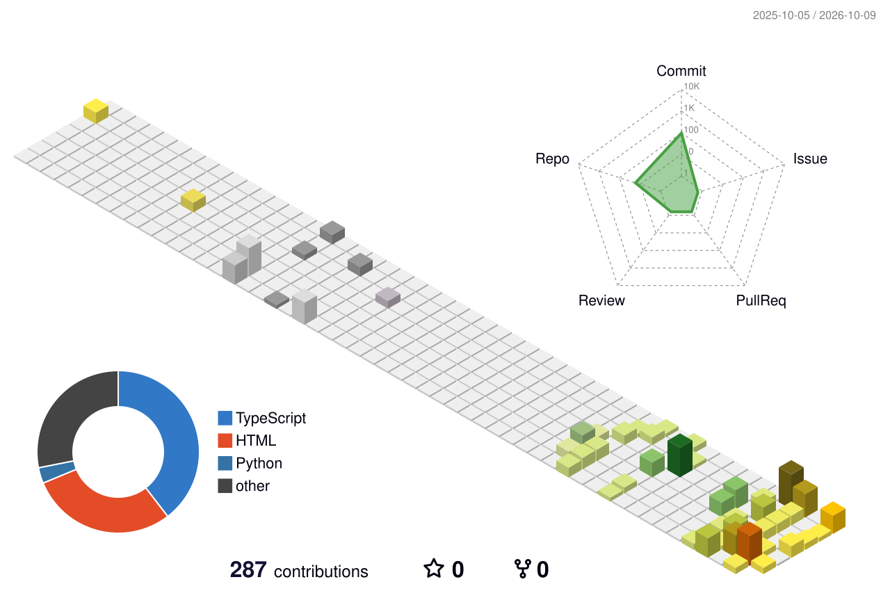

<!-- Animated Neon Matrix Header -->

  

<!-- Profile Views & Animated Status Badges -->

  
  
  

<!-- Animated Typing Text -->

  

<!-- Pixel Art Gaming Mascot Animation -->

  

---

##  About Me

I'm a **Computer Science & Technology student** passionate about building modern web applications and exploring the world of **Artificial Intelligence and Machine Learning**.

I enjoy turning ideas into real-world projects, learning new technologies, and continuously improving my problem-solving skills.

###  Currently Focused On

-  Building modern web applications with **React**
-  Learning **TypeScript** and writing better, scalable code
-  Developing backend applications with **Node.js & Express**
-  Working with **MongoDB** and **REST APIs**
-  Strengthening my **Python** programming skills
-  Exploring **Machine Learning** and **Artificial Intelligence**
-  Improving problem-solving and programming fundamentals
-  Building projects to learn by doing

---

##  Tech Stack

###  Languages

  

###  Frontend

  

###  Backend & APIs

  

###  Database & Services

  

###  Tools

  

---

##  Featured Projects

| Project | Description | Focus |
| :--- | :--- | :--- |
| ** DipLora** | A student-focused AI assistant designed to help students with learning and productivity. | `AI` • `Web Development` • `Productivity` |
| ** DevConf 2026** | A modern conference website designed for a developer-focused event. | `Responsive UI` • `Modern Design` • `Frontend` |
| ** Portfolio Website** | A personal portfolio website showcasing my skills, projects, and development journey. | `HTML` • `CSS` • `JavaScript` |

---

##  Learning Journey

  

###  My Goals
- Become a strong **Full-Stack Developer**
- Become a **Machine Learning Engineer**
- Build real-world **AI-powered applications**
- Improve problem-solving skills
- Contribute to meaningful **open-source projects**
- Keep learning and improving every day

---
<!-- 3D Contribution Graph -->

  

 

  <!-- GitHub Stats -->
  
  
  <!-- Top Languages -->
  

 

  <!-- GitHub Streak -->
  

 

<!-- Contribution Snake Animation -->

  

---

##  Developer Mindset

bash
Learn ➔ Build ➔ Break ➔ Debug ➔ Improve ➔ Repeat
